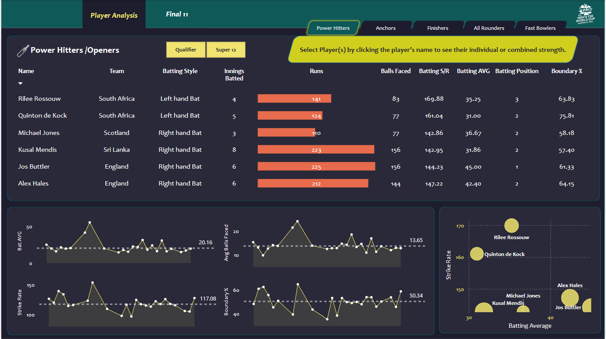
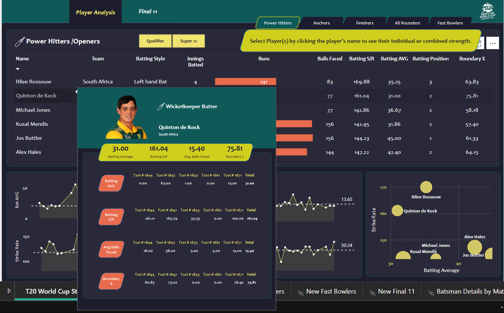
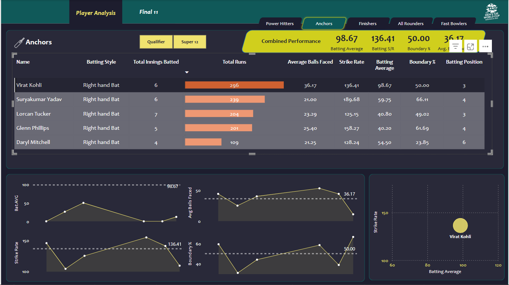
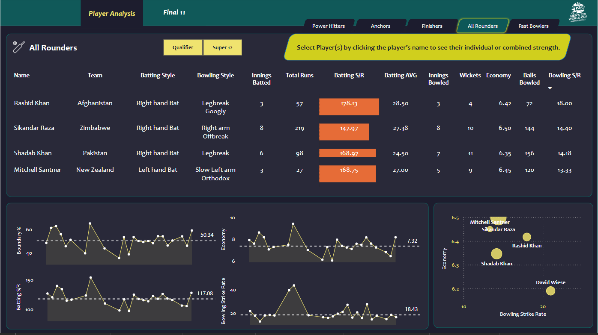
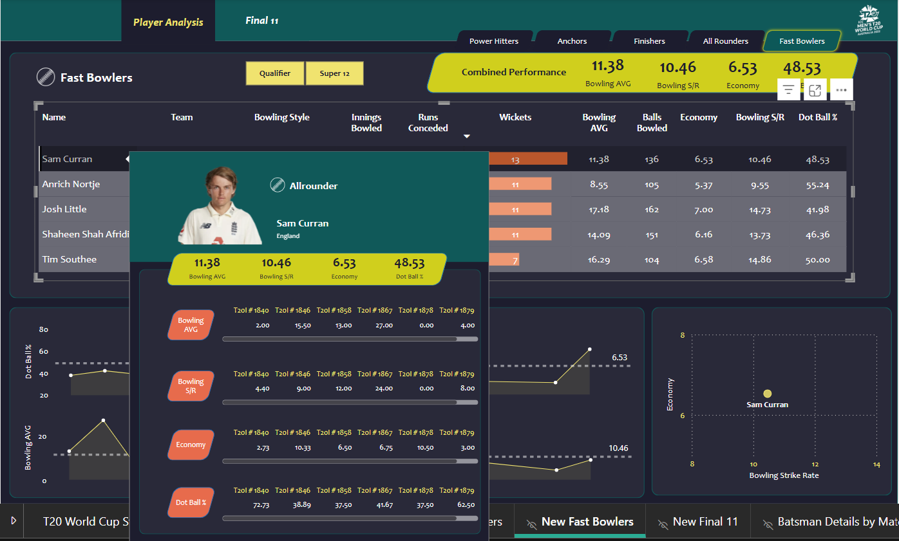
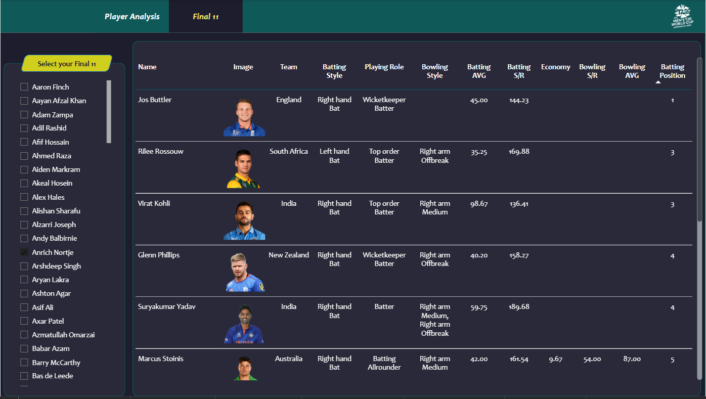

#  2022 T20 World Cup Dashboard

## Table of contents 
- [Overview](#overview)
- [Data](#data)
- [Dashboard Highlights](#dashboard-highlights)
- [Player Classification Criteria](#player-classification-criteria)
- [Tools Used](#tools-used)
- [Dashboard Access Steps](#dashboard-access-steps)
- [Dashboard Preview](#dashboard-preview)
- [DAX Used](#dax-used)

##  Overview

This is a cricket analytics Power BI dashboard designed to identify the best playing XI based on detailed performance metrics. 

The dashboard allows users to filter and shortlist players based on specific role-based performance criteria, helping select a team that can:
- **Score at least 180 runs on average**
- **Defend a target of 150 runs on average**

---
## Data

- Data has been taken from Kaggle [[Dataset Link]](https://www.kaggle.com/datasets/rajsengo/icc-mens-t20-world-cup)
- The data consists of match level details, summary, batting card and bowling card of each match
- Relevant information has been captured and the clean data is present in the data directory

---
##  Dashboard Highlights

- Fully interactive Power BI report
- Role-wise player segmentation: Openers, Anchors, Finishers, All-rounders, Fast Bowlers
- Filterable KPIs such as batting average, strike rate, bowling economy, and more
- Built-in logic to shortlist top candidates for each role

---

##  Player Classification Criteria

###  Openers
| Parameter         | Criteria |
|------------------|----------|
| Batting Average   | > 30     |
| Strike Rate       | > 140    |
| Innings Batted    | > 3      |
| Boundary %        | > 50%    |
| Batting Position  | < 4      |

###  Anchors / Middle Order
| Parameter         | Criteria |
|------------------|----------|
| Batting Average   | > 40     |
| Strike Rate       | > 125    |
| Innings Batted    | > 3      |
| Avg. Balls Faced  | > 20     |
| Batting Position  | > 2      |

###  Finishers / Lower Order Anchors
| Parameter         | Criteria |
|------------------|----------|
| Batting Average   | > 25     |
| Strike Rate       | > 130    |
| Innings Batted    | > 3      |
| Avg. Balls Faced  | > 12     |
| Batting Position  | > 4      |
| Innings Bowled    | > 1      |

###  All-Rounders
| Parameter           | Criteria |
|--------------------|----------|
| Batting Average     | > 15     |
| Strike Rate         | > 140    |
| Innings Batted      | > 2      |
| Batting Position    | > 4      |
| Innings Bowled      | > 2      |
| Bowling Economy     | < 7      |
| Bowling Strike Rate | < 20     |

###  Specialist Fast Bowlers
| Parameter           | Criteria      |
|--------------------|---------------|
| Innings Bowled      | > 4           |
| Bowling Economy     | < 7           |
| Bowling Strike Rate | < 16          |
| Bowling Style       | Contains "Fast" |
| Bowling Average     | < 20          |
| Dot Ball %          | > 40%         |

---

##  Tools Used

- **Power BI Desktop**
- **Excel / CSV** for data preparation
- **DAX** for custom KPIs and metrics
- **Power Query** for data transformation

---

##  Dashboard Access Steps

1. Open the `.pbix` file in Power BI Desktop.
2. Use slicers and filters to explore different role-based selections.
3. View recommended players based on the preset selection logic.

---

## Dashboard Preview
1. Base



2. Player Details in Tooltip - Power Hitter/ Openers



3. Selected Player Statistics - Anchors



4. All Rounders Page



5. Selected Player Tooltip and Statistics - Fast Bowlers



6. Final 11 Page



7. Dashboard in Action


## DAX Used

### Batting Parameters

```
Average Balls Faced = AVERAGE(fact_batting_summary[Balls])
Batting Average = DIVIDE([Total Runs], [Total Innings Dismissed], 0)
Batting Position = ROUNDUP(AVERAGE(fact_batting_summary[Batting Pos]),0)
Boundary % = DIVIDE(SUM(fact_batting_summary[Boundary Runs]), [Total Runs], 0)*100
Strike Rate = DIVIDE([Total Runs], [Total Balls Faced], 0)*100
Total Balls Faced = SUM(fact_batting_summary[Balls])
Total Innings Batted = COUNT(fact_batting_summary[Match ID])
Total Innings Dismissed = SUM(fact_batting_summary[OUT])
Total Runs = SUM(fact_batting_summary[Runs])
```

### Bowling Parameters

```
Balls Bowled = Sum(fact_bowling_summary[Balls])
Bowling Average = DIVIDE([Runs Conceded], [Wickets], 0)
Bowling Strike Rate = DIVIDE([Balls Bowled], [Wickets],0)
Dot Ball % = DIVIDE(SUM(fact_bowling_summary[Zeroes]),[Balls Bowled], 0)*100
Economy = DIVIDE([Runs Conceded],[Balls Bowled],0)*6
Runs Conceded = SUM(fact_bowling_summary[Runs])
Total Innings Bowled = DISTINCTCOUNT(fact_bowling_summary[Match ID])
Wickets = SUM(fact_bowling_summary[Wickets])
```